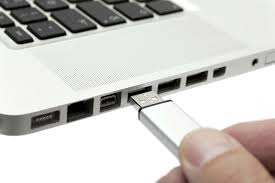

# usbmon

CLI monitoring of USB devices. Rerun a command when USB devices are connected & disconnected.

## Installation:

```sh
$ npm install usbmon -g
```

## Usage:

Rerun a CLI process whenever USB devices change

```sh
$ usbmon

Usage: usbmon <command>

where <command> is any cli command for your system

Examples:

usbmon ls
usbmon lsusb
usbmon curl -I http://my.domain.com/notify/usb/change?device=6b2e0a8
```

Note that `usbmon` uses [`libudev`](https://www.freedesktop.org/software/systemd/man/libudev.html) behind the scenes. 

In Linux/Ubuntu you might need to install it:

```
sudo apt-get install build-essential libudev-dev
```

Use Cases:

Nodebots:

```
usbmon node simplebot/examples/attach-controller.js
```

Monitoring and notificaiton of USB Devices

```
$ usbmon curl -I http://my.domain.com/notify/usb/change?device=6b2e0a8
```
